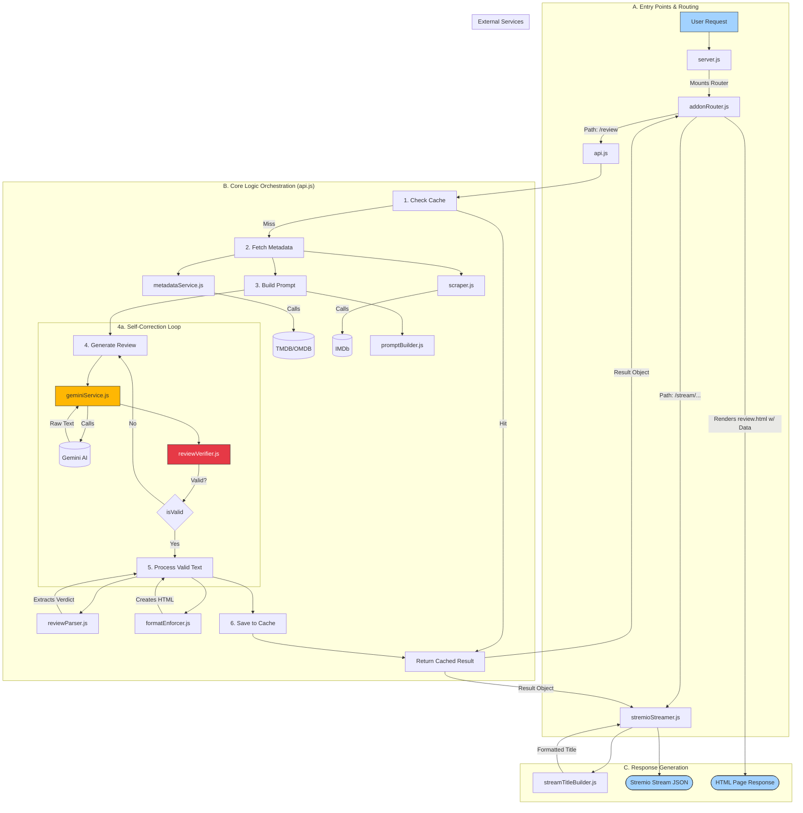

# The Quick Reviewer — Stremio Addon

Provides spoiler-free, bullet-point AI reviews for movies and series episodes as a single stream link, powered by Google Gemini. This addon is designed for easy deployment and robust performance, with a focus on delivering high-quality, structured content directly within the Stremio interface.

## Key Features

*   **🌐 Multi-Language Translation:** Seamlessly translate reviews into 20 of the world's most spoken languages using a direct integration with Google Translate.
*   **🤖 AI Self-Correction & Verification:** A internal verifier automatically validates the format of every AI-generated review. If the AI returns an incorrect format (e.g., a movie review for a TV series), the addon will automatically retry the generation to ensure the correct content is always served.
*   **✨ Modern & Responsive UI:** The review page has been completely redesigned for a clean, professional, and responsive user experience on both desktop and mobile devices.
*   **🔒 Optional Password Protection:** Secure your addon endpoint with a single password. Includes IP-based rate-limiting to prevent brute-force attacks.
*   **⚡ Smart Performance:**
    *   **Concurrent Request Handling:** Prevents duplicate API calls when multiple users request the same review simultaneously.
    *   **Server-Side Rendering (SSR):** The review page is rendered on the server, ensuring near-instant load times and fixing all compatibility issues with Google Translate.
    *   **In-memory Caching:** Caches generated reviews to reduce API usage and provide faster subsequent loads.
*   **🌐 Reliable Metadata:** Fetches media details primarily from TMDB, with OMDB as a robust fallback.
*   **🕷️ Web Scraping:** Intelligently scrapes IMDb for supplementary data like specific episode titles to provide more accurate context to the AI.
*   **⚙️ Admin & Debugging:** When password-protected, provides access to a page listing all currently cached reviews and their metadata.

## Architecture Flowchart

This diagram illustrates the request lifecycle, from Stremio to the final review, including the new self-correction loop.



## Configuration (Environment Variables)

To run the addon, you need to set the following environment variables. This is crucial for self-hosting or deploying on platforms like Hugging Face Spaces.

| Variable | Description | Required |
| :--- | :--- | :---: |
| `TMDB_API_KEY` | Your API key from The Movie Database (TMDB). | **Yes** |
| `OMDB_API_KEY` | Your API key from the OMDb API. | **Yes** |
| `GEMINI_API_KEY` | Your API key from Google AI Studio for the Gemini model. | **Yes** |
| `BASE_URL` | The public URL of your deployed addon (e.g., `https://your-space.hf.space`). | **Yes** |
| `ADDON_PASSWORD` | An optional password to secure all addon endpoints. | No |
| `ADDON_TIMEOUT_MS` | (Optional) Milliseconds to wait for review pre-generation. Defaults to `13000` (13 seconds). | No |

## Deployment on Hugging Face Spaces

1.  **Create a Space:** In Hugging Face, create a new Space using the **Docker** template and make it public.
2.  **Add Environment Variables:** In your Space's **Settings**, go to **Variables and Secrets** and add the required variables listed above.
3.  **Push the Code:** Clone this repository and push the code to your Hugging Face Space. The `Dockerfile` will handle the rest of the setup and installation.
4.  Wait for the Space to build and start. Your addon is now live.

## Usage in Stremio

The installation method depends on whether you have set a password.

#### **If No Password is Set (Unsecured):**

1.  Find your addon's manifest URL: `https://<your-space-url>/manifest.json`
2.  Copy this URL and paste it into the search bar in Stremio to install the addon.

#### **If a Password is Set (Secured):**

1.  Navigate to the root URL of your addon in a web browser: `https://<your-space-url>/`
2.  Enter the password you set in the `ADDON_PASSWORD` environment variable.
3.  Upon successful validation, you will be presented with two links:
    *   **Install Addon:** Click this to install the addon directly in Stremio.
    *   **View Cached Reviews:** This opens the admin page to see all cached items.

Once installed, a "⚡ Quick AI Review" stream will appear for any movie or series episode. Clicking it will open the interactive review page.

## Folder Structure

The project has been refactored into a modular structure for better maintainability and scalability.

```
The-Quick-Reviewer/
├── Dockerfile                 # Docker configuration for deployment
├── server.js                  # Main Express server entry point
├── manifest.json              # Stremio addon manifest
├── package.json               # Project dependencies and scripts
├── public/                    # Static files (HTML, CSS, assets) served to the user
│   ├── index.html             # Dynamic landing page with password prompt
│   ├── review.html            # The SSR-powered, interactive review page
│   ├── cached-reviews.html    # Page to display all cached reviews
│   └── css/                   # Stylesheets for the UI
│       ├── global.css
│       ├── cached.css
│       └── review.css
└── src/                       # Main application source code
    ├── api.js                 # Core orchestrator for review generation & self-correction
    ├── config/
    │   └── promptBuilder.js   # Constructs the AI prompt
    ├── core/
    │   ├── cache.js           # In-memory cache management
    │   ├── formatEnforcer.js  # Cleans and structures the final HTML
    │   ├── reviewParser.js    # Extracts the one-line verdict from raw AI text
    │   ├── reviewVerifier.js  # Validates AI output to trigger self-correction
    │   ├── scraper.js         # Handles IMDb web scraping
    │   └── stremioStreamer.js # Builds the Stremio stream response
    ├── routes/
    │   └── addonRouter.js     # Handles ALL Stremio and internal API routes
    └── services/
        ├── geminiService.js   # Manages interaction with the Gemini API
        └── metadataService.js # Fetches data from TMDB and OMDB
```

## License

This project is licensed under the MIT License. See the [LICENSE](LICENSE) file for details.
